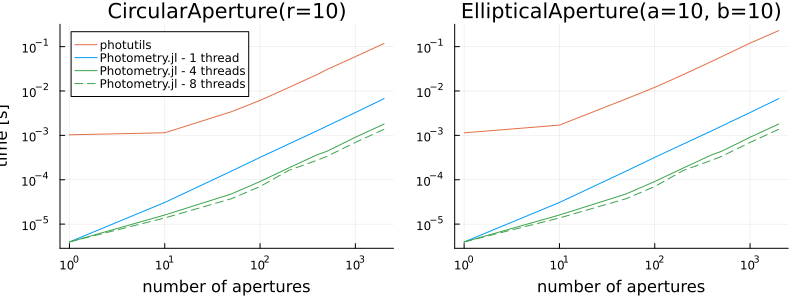
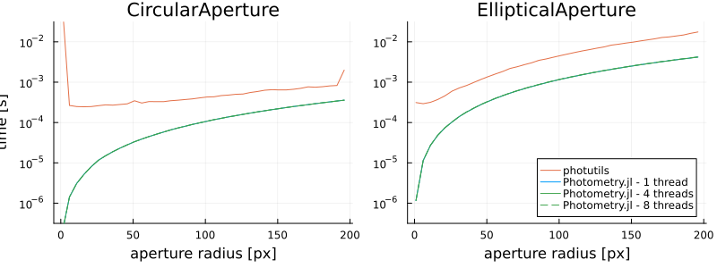

# Aperture Photometry

## Introduction

Aperture photometry uses [Apertures](@ref) to cut out and sum values in an image. A very basic mask might be a square of pixels at a certain position. We can model this as a matrix of ones and zeros like
```julia
⎡0 0 0 0 0⎤
⎢0 1 1 1 0⎥
⎢0 1 1 1 0⎥
⎢0 1 1 1 0⎥
⎣0 0 0 0 0⎦
```
If we have some data like
```julia
⎡7 9 6 0 8⎤
⎢8 5 8 7 9⎥
⎢5 6 2 2 7⎥
⎢9 7 3 4 1⎥
⎣7 8 0 9 8⎦
```
then the result of our aperture photometry looks like
```julia
⎡0 0 0 0 0⎤    ⎡7 9 6 0 8⎤     ⎡0 0 0 0 0⎤
⎢0 1 1 1 0⎥    ⎢8 5 8 7 9⎥     ⎢0 5 8 7 0⎥
⎢0 1 1 1 0⎥ .* ⎢5 6 2 2 7⎥  =  ⎢0 6 2 2 0⎥
⎢0 1 1 1 0⎥    ⎢9 7 3 4 1⎥     ⎢0 7 3 4 0⎥
⎣0 0 0 0 0⎦    ⎣7 8 0 9 8⎦     ⎣0 0 0 0 0⎦

sum(result) = 44
```

This module uses the above principal with common aperture shapes in a fast and precise manner, including exact overlaps between apertures and pixels.

The majority of the lifting is done with the [`photometry`](@ref) function with common shapes being described in [Apertures](@ref). It is possible to create a custom aperture by sub-typing the [`Aperture.AbstractAperture`](@ref) class, although it may be easier to perform PSF photometry instead.

## Pixel Convention

`Photometry.jl` follows the same convention as FITS, WCS, IRAF, DS9, and SourceExtractor with `(1, 1)` being the _center_ on the bottom-left pixel. This means the exact bottom-left corner is at `(0.5, 0.5)`. Pixels increase up and to the right until `axis_length + 0.5`.


## API/Reference

```@docs
photometry
```

## Performance

Below are some benchmarks comparing the aperture photometry capabilities of `Photometry.jl` with the [photutils](https://github.com/astropy/photutils) asropy package. The benchmark code can be found in the [`bench` folder](https://github.com/JuliaAstro/Photometry.jl/blob/master/bench/). Note that for the multi-threaded examples my machine has 4 physical cores with 8 threads.

```julia-repl
julia> versioninfo()
Julia Version 1.5.0
Commit 96786e22cc (2020-08-01 23:44 UTC)
Platform Info:
  OS: macOS (x86_64-apple-darwin18.7.0)
  CPU: Intel(R) Core(TM) i5-8259U CPU @ 2.30GHz
  WORD_SIZE: 64
  LIBM: libopenlibm
  LLVM: libLLVM-9.0.1 (ORCJIT, skylake)
```

### Number of Apertures

This benchmark shows how performance scales as we increase the number of apertures. The apertures are distributed randomly across the image with a fixed radius of 10. The image size is (512, 512). We see an improvement of ~10-100x (depending on multithreading) over photutils.



### Size of Apertures

This benchmark analyzes how the aperture size affects performance. Theoretically it should increase with `O(n^2)` complexity. For aperture sizes increasing from 1 to 200,  located in the center of a an image of size (512, 512).


