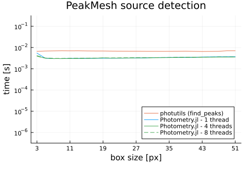

# Source Detection

The module provides tools and algorithms for detecting and extracting point-like sources.

## Performance

Below are some benchmarks comparing the source detection capabilities of `Photometry.jl` with the [photutils](https://github.com/astropy/photutils) astropy package. The benchmark code can be found in the [`bench` folder](https://github.com/JuliaAstro/Photometry.jl/blob/main/bench/).

```julia-repl
Julia Version 1.12.6
Commit 15346901f00 (2026-04-09 19:20 UTC)
Build Info:
  Official https://julialang.org release
Platform Info:
  OS: Linux (x86_64-linux-gnu)
  CPU: 12 × AMD Ryzen 5 PRO 6650U with Radeon Graphics
  WORD_SIZE: 64
  LLVM: libLLVM-18.1.7 (ORCJIT, znver3)
  GC: Built with stock GC
Threads: 1 default, 1 interactive, 1 GC (on 12 virtual cores)
```



## API/Reference

```@docs
extract_sources
```
